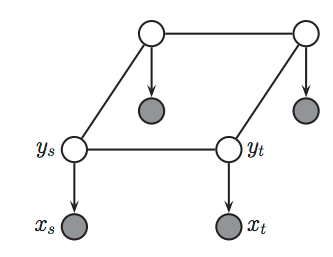
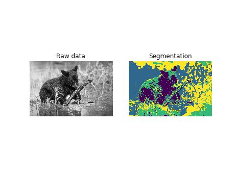
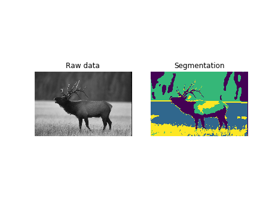
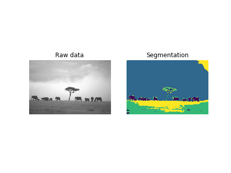

# Image Segmentation - Markov Random Fields, Expectation Maximization

I wanted to experiment with graphical models and Markov Random Fields (MRF) seemed very interesting. I found a [paper describing EM for segmentation](https://hal.inria.fr/inria-00072132/document) as well as the Potts model. This model is used more for statistical mechanics but seemed useful for segmentation as well.

This is a figure describing the Potts model used.

### Results

Here are some examples of the results of the segmentation:

