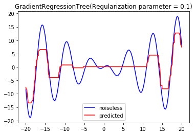

# Regression Trees

These seemed intriguing to me and I wanted to try to use these for regression instead of classification to see what happens. For an in-depth analysis of the models, please see `Regression-Experiments.pdf` document.

### Models implemented: regression tree, gradient-boosted regression tree (GBRT)

For the regression tree, the base cases to create a leaf node included a max depth, having fewer than one example to pass onto a child node, or zero-variance in the child node's data.

