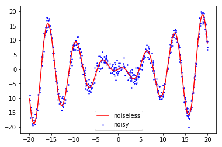
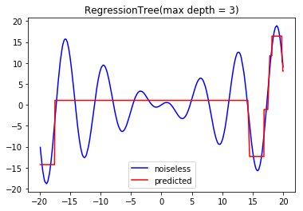
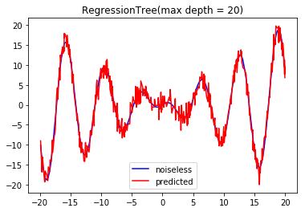
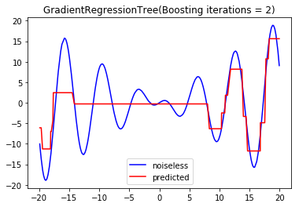
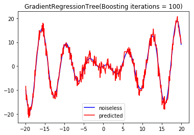
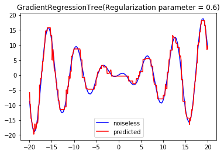

# Regression Trees

Decision trees seemed intriguing to me and I wanted to use them for regression instead of classification to see what happens. For an in-depth analysis of the models, please see the [Regression Experiments document.](https://github.com/akashc1/projects/blob/master/learning-models/regression-tree/Regression-Experiments.pdf)

### Models implemented: regression tree, gradient-boosted regression tree (GBRT)

For the regression tree, the base cases to create a leaf node included a max depth, having fewer than one example to pass onto a child node, or zero-variance in the child node's data.

#### Generating sample data

I used an RNG and added noise and a cosine function to generate data that looks like this:

#### Playing with max depth

A max depth of 3 had the following sort of underfitting:

And a max depth of 20 had pretty strong overfitting:

### GBRT - Results of boosting

I had never implemented any sort of boosting algorithm so this was very interesting to play around with, especially considering that almost all of the learners (regression trees) are essentially fitting residual error.

#### Playing with number of boosting iterations

Similar to the depth in the regular regression tree, the GBRT with only 2 boosting iterations showed strong underfitting:

And with 100 iterations, the overfitting was very strong:

#### Regularization in regression trees

A regularization parameter of 0.6 resulted in a pretty nice fit of the generated data:

