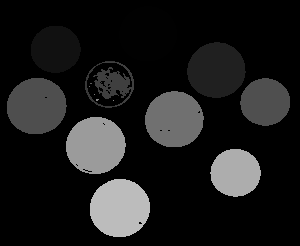
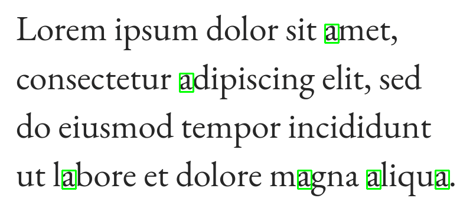
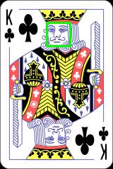
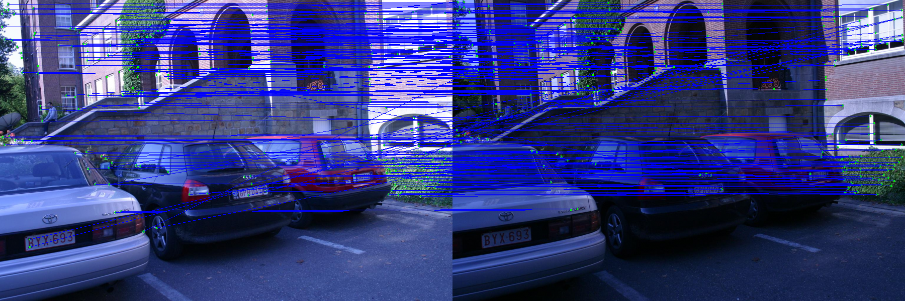
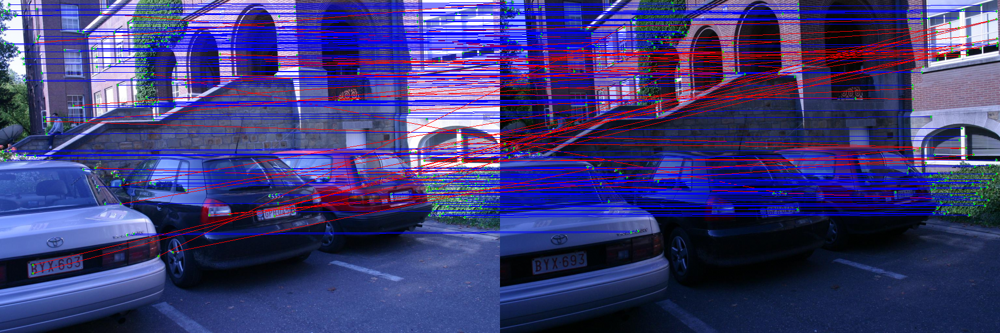
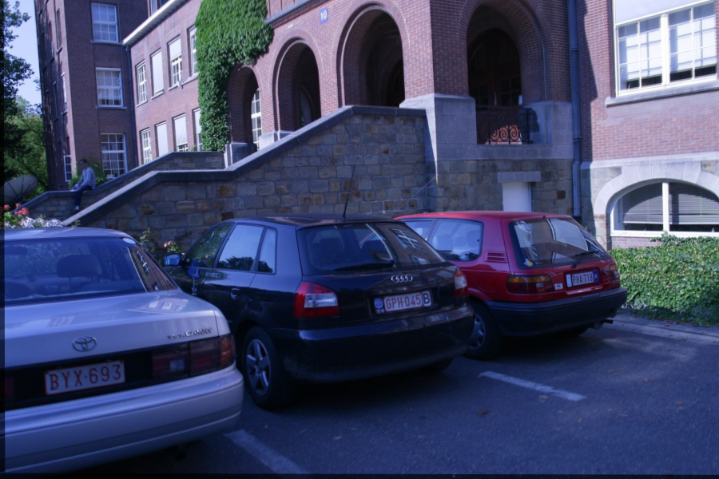

# Computer Vision

### akashc@jhu.edu

Some vision tasks I have taken on. Most of it is lower level stuff I implemented to get an understanding of how stuff works. Most of these things are probably in OpenCV.

#### [Image Labeling, Hough Circle Detection, Template Matching](./label-circ-match)

This implementation of image labeling is pretty quick and can identify individual objects in an image. This is not a learning-based approach, rather a standard sequential labeling algorithm.

The circle detection was just based on my interest in the Hough voting methods for circle/line detection, and the circle case seemed more interesting to me.

Template matching seemed very straightforward to me but as I expected, there were the edge cases I had to think about which was a quick and interesting challenge.

#### [Image Alignment, RANSAC Feature Matching, and Stitching](./im-alignment)

This part came from my interest in image transformations and feature extraction. I implemented a Harris corner detector, a RANSAC algorithm to match corners from 2 images, and a least-squares method to solve for a transformation to align two given images. There's also a simple method of stitching the aligned images together.

