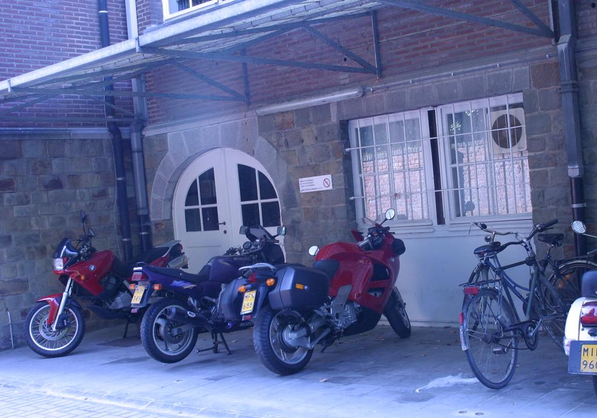

## Image Alignment, RANSAC Feature Matching, and Stitching

I have worked with features before, but wanted to try to implement a corner detector. I also read a bit about image alignment and ran into RANSAC, which seemed like a cool method. 

### Part 1: Corner Detection

Naturally I found the Harris Corner Detector. The intuition made sense to me (find regions which result in a large intensity change in any direction), but it took a while for me to understand how it leads to the eigenvalue-based classification.

I used the following parameters for the corner detection (evident in `src/image_alignment.py`):

Window Diameter | k (coefficient for trace) | Sobel Kernel Diameter | R (cornerness) threshold | Non-max Suppression Window Diameter
--------------- | ------------------------- | --------------------- | ----------- | -----------------------------------
7 pixels | 0.05 (seems to be standard) | 3 | 0.01 | 7

Here's an original image:

And here are the detected corners (image blown up so you can actually see the green dots):

**Summary:** I think it worked very well with these parameters, but for different size corners the parameters may have to be changed since corners are not size-invariant.

### Part 2: Feature Matching

This is where I learned about RANSAC, which was intimidating, but not too bad. There were more parameters I had to play around with quite a bit here, and here they are for the example shown:

Region Window Diameter | p (probability at least one trial has no outliers) | e (approximated outlier proportion in data) | s (number of data points required to define a transform) | Inlier Threshold (max. distance between transformed point and its true match to be considered an inlier)
---------------------- | -------------------------------------------------- | ------------------------------------------- | -------------------------------------------------------- | --------------------------------------------------------------------------------------------------------
9 pixels | 0.999 | 0.5 | 3 | 20
