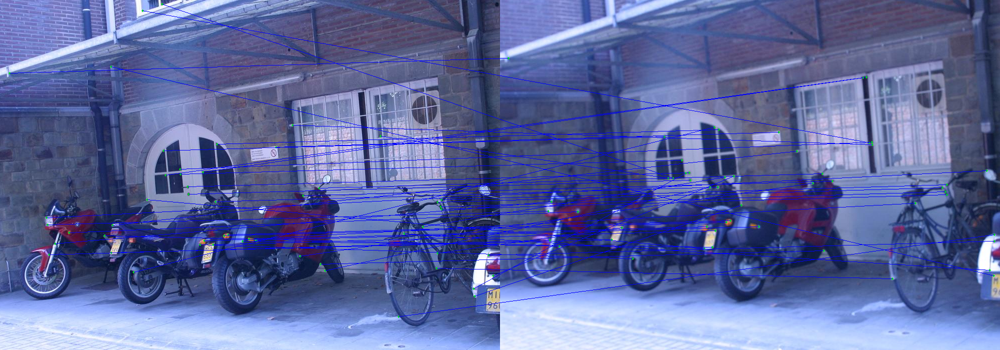
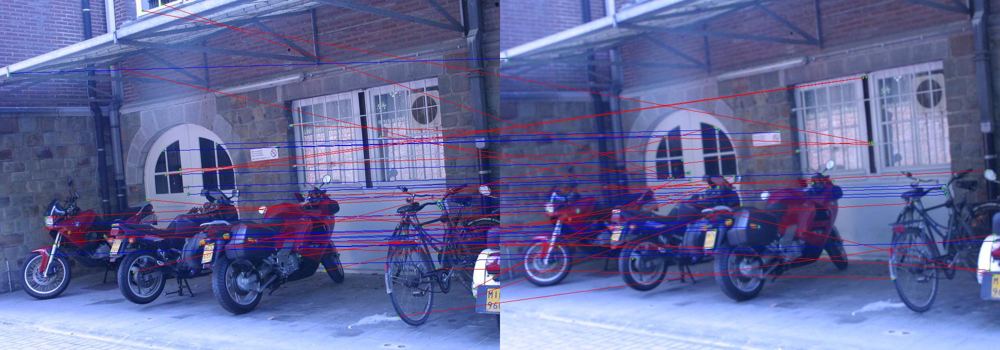
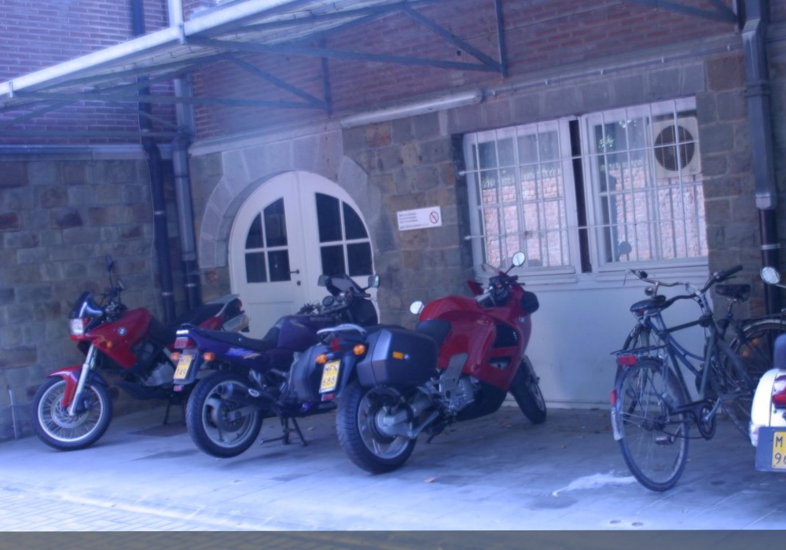

## Image Alignment, RANSAC Feature Matching, and Stitching

I have worked with features before, but wanted to try to implement a corner detector. I also read a bit about image alignment and ran into RANSAC, which seemed like a cool method. 

### Part 1: Corner Detection

Naturally I found the Harris Corner Detector. The intuition made sense to me (find regions which result in a large intensity change in any direction), but it took a while for me to understand how it leads to the eigenvalue-based classification.

I used the following parameters for the corner detection (evident in `src/image_alignment.py`):

Window Diameter | k (coefficient for trace) | Sobel Kernel Diameter | R (cornerness) threshold | Non-max Suppression Window Diameter
--------------- | ------------------------- | --------------------- | ----------- | -----------------------------------
7 pixels | 0.05 (seems to be standard) | 3 | 0.01 | 7

##### Sample

Here's an original image:

And here are the detected corners (image blown up so you can actually see the green dots):

**Summary:** I think it worked very well with these parameters, but for different size corners the parameters may have to be changed since corners are not size-invariant.

### Part 2: Feature Matching

This is where I learned about RANSAC, which was intimidating, but not too bad. The basic premise is to have a two-way matching process where features in each image are paired with a feature in the other image if they both are each other's closest region based on Euclidian distance. Then, an N is calculated using the parameters (described below) which determines the number of trials that will be run. For each trial, s matches are randomly chosen, for which an affine transform is calculated using least-squares. For each trial, the inlier count (number of all matches that are inliers with this trial's affine transform) is taken, and the transform with the highest inlier count is taken as the final transformation. There were more parameters I had to play around with quite a bit here, and here they are for the example shown:

Region Window Diameter | p (probability at least one trial has no outliers) | e (approximated outlier proportion in data) | s (number of data points required to define a transform) | Inlier Threshold (max. distance between transformed point and its true match to be considered an inlier)
---------------------- | -------------------------------------------------- | ------------------------------------------- | -------------------------------------------------------- | --------------------------------------------------------------------------------------------------------
9 pixels | 0.999 | 0.5 | 3 | 20

##### Sample

Here's the two images stacked and showing the matches found:

And here's the same thing but with outlier matches using the best transform from RANSAC marked as red:

**Summary:** What indicated that it worked well is that the inlier matches (which stay blue) are all in the same direction and have similar magnitude.

### Part 3: Stitching

This part was pretty simple, but I cheated by using the OpenCV's `warpAffine()` method to apply the actual transformation. Beyond that, the blending was just done with a 50-50 weighted average between the two images.

##### Sample

Here's the stitched images:

**Summary:** Clearly the images line up very well, so I'd say it worked very well. I'm not sure if there's a metric to evaluate the efficacy of this method.
