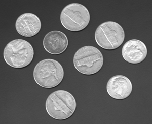
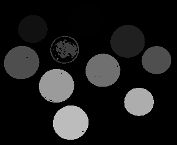
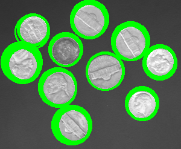

## [Image Labeling, Hough Circle Detection, Template Matching]

These were some basic computer vision techniques that seemed interesting and that I wanted to try. There are probably libraries like OpenCV that do these more efficiently, but I wanted to do this for implementation practice.

### Part 1: Image Labeling

Labeling seemed pretty straightforward and useful as a rudimentary object detection method. It's based on binary image processing, and here I implemented the [sequential labeling method for connected components](https://en.wikipedia.org/wiki/Connected-component_labeling)

##### Results

Here's the original image: 

And here's the labeled image with each connected component with a different label. It may be hard to see some of the coins since they have low labels which translate to darker colors:

### Part 2: Circle Detection

I learned about Hough line/circle detection and was intriguied by the voting method in a parameter space. I wanted to try implementing this with circles. It was pretty starightforward, and despite a pretty inefficient implementation, it runs pretty quick. An improvement I would make would be to add non-maximum suppression to make sure that for one ground truth circle, there aren't multiple circles identified for it.

##### Results

Here's the coincs with detected circles in green.

